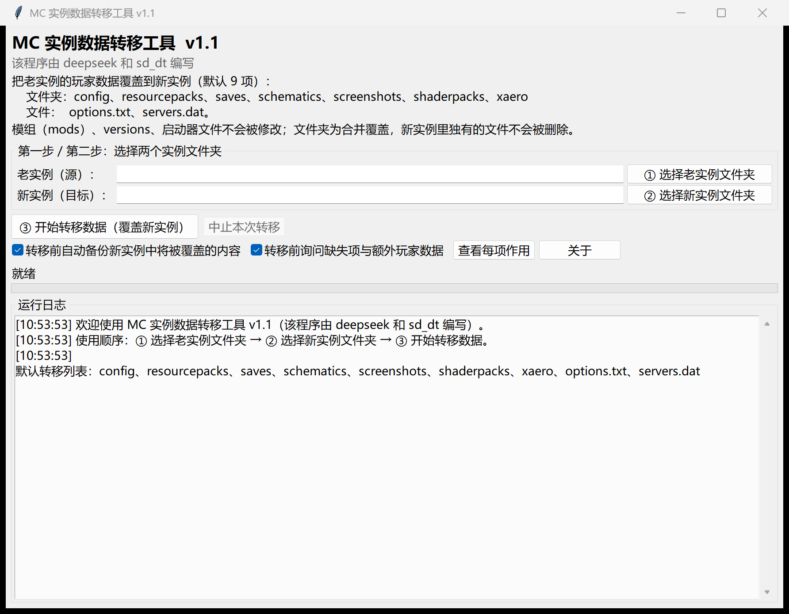
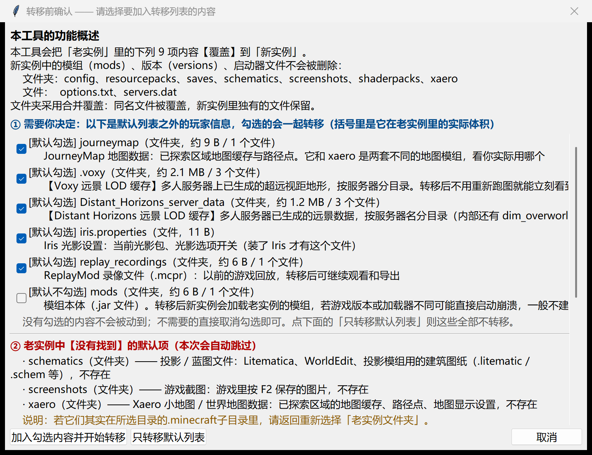
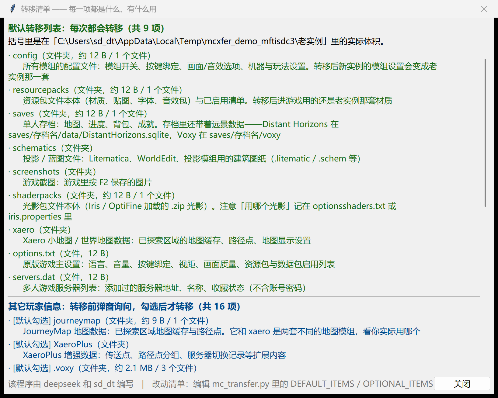
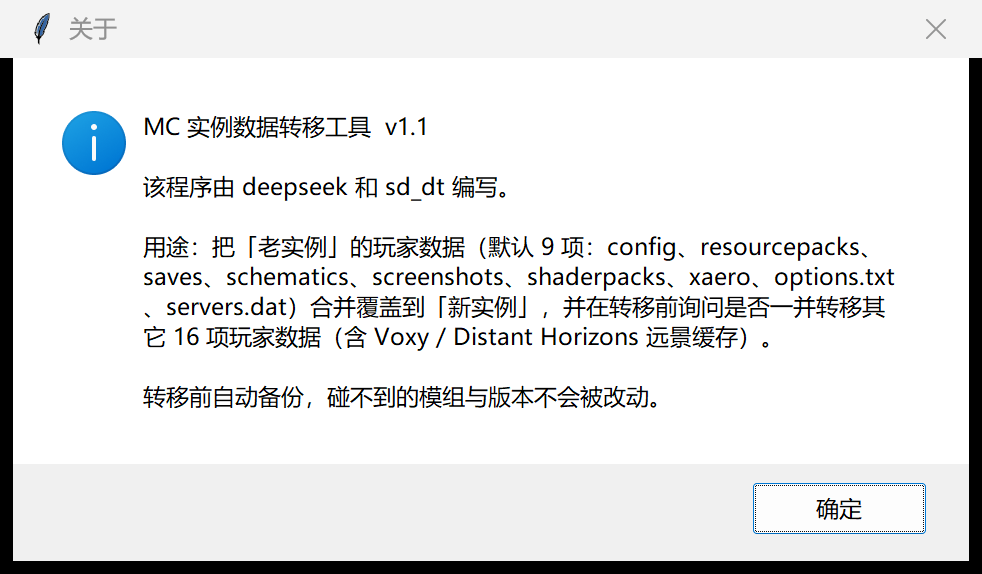

<div align="center">


# MC 实例数据转移工具

**把老 Minecraft 实例的玩家数据，一次搬家到新实例。**

单文件免安装的 Windows 桌面程序（Python + tkinter），合并覆盖、转移前自动备份、
发现额外玩家数据会先问你一句（含 Voxy / Distant Horizons 远景缓存）。


**该程序由 deepseek 和 sd_dt 编写。**

</div>

---

## 这是什么

换整合包、换游戏版本、重装实例的时候，模组和版本可以重下，
但**存档、按键、小地图路径点、光影设置、远景缓存**这些「只属于你的东西」重来一遍很痛苦。

这个工具就是干这件事的：选两个文件夹，点一下，把你攒下来的玩家数据整体搬过去。

- ✅ **只搬玩家数据**：`mods`、`versions`、启动器文件一律不动
- ✅ **合并覆盖**：同名文件被覆盖，新实例里独有的文件**不会删除**（存档不会被清空）
- ✅ **转移前自动备份**：被覆盖的内容先存到 `<新实例>\_转移备份_日期_时间\`
- ✅ **缺什么会告诉你**：老实例里没有的项逐条列出并自动跳过，不会中途报错
- ✅ **多发现的会问你**：默认 9 项之外还发现别的玩家数据时，弹窗逐条列出**实际体积**，
  勾选后才转移（Voxy / Distant Horizons 的远景缓存就在这一档）

## 界面

| 主界面 | 转移前确认 |
|---|---|
|  |  |

| 转移清单（每项作用） | 关于 |
|---|---|
|  |  |

## 下载与使用

1. 到 [**Releases**](../../releases/latest) 下载 `MC实例数据转移工具.exe`
2. 双击运行（免安装、无需 Python 环境）
3. 按界面三个按钮走：

| 顺序 | 按钮 | 说明 |
|---|---|---|
| ① | **选择老实例文件夹** | 原来那个实例的游戏目录（数据来源） |
| ② | **选择新实例文件夹** | 要转移进去的实例目录（数据目标） |
| ③ | **开始转移数据（覆盖新实例）** | 开始搬家，先备份、再覆盖 |

> 选错目录也没关系：如果选的是包含 `.minecraft` 的上一层目录，程序会**自动下钻**；
> 如果一个默认项都找不到，会直接提示你重选。

## 转移列表

### 默认转移（9 项，不再询问）

| 名称 | 类型 | 实际作用 |
|---|---|---|
| `config` | 文件夹 | 所有模组的配置文件：模组开关、按键绑定、画面/音效选项、机器与玩法设置 |
| `resourcepacks` | 文件夹 | 资源包文件本体（材质、贴图、字体、音效包）与已启用清单 |
| `saves` | 文件夹 | 单人存档：地图、进度、背包、成就（**含存档内的 DH / Voxy 远景数据**） |
| `schematics` | 文件夹 | 投影 / 蓝图文件（.litematic / .schem 等） |
| `screenshots` | 文件夹 | 游戏截图（F2 保存的图片） |
| `shaderpacks` | 文件夹 | 光影包本体（Iris / OptiFine 加载的 .zip） |
| `xaero` | 文件夹 | Xaero 小地图 / 世界地图：地图缓存、路径点、显示设置 |
| `options.txt` | 文件 | 原版主设置：语言、音量、按键、视距、画面质量、资源包启用列表 |
| `servers.dat` | 文件 | 多人游戏服务器列表（地址、名称、收藏，不含账号密码） |

### 转移前询问（16 项，勾选后才转移）

默认勾选：`journeymap`、`XaeroPlus`、**`.voxy`**、**`Distant_Horizons_server_data`**、
`optionsof.txt`、`optionsshaders.txt`、`iris.properties`、`replay_recordings`、
`CustomSkinLoader`、`tacz`、`command_history.txt`

默认不勾选（怕影响新实例，交给你决定）：`essential`、`mods`、`defaultconfigs`、`PCL`、`hmcl.json`

<details>
<summary><b>关于两个远景缓存（点开看细节）</b></summary>

| 项 | 位置 | 说明 |
|---|---|---|
| `.voxy` | 实例根目录 | Voxy 的多人服务器远景 LOD 缓存，按服务器分目录。转移后不用重新跑图，体积可能好几个 GB |
| `Distant_Horizons_server_data` | 实例根目录 | Distant Horizons 的多人服务器远景缓存，按服务器名分目录。体积一般比 Voxy 小 |
| `saves/<存档>/voxy`、`saves/<存档>/data/DistantHorizons.sqlite` | 存档内 | **单人存档的远景数据**，随 `saves` 一起转移，无需单独勾选 |

</details>

## 安全设计

| 机制 | 说明 |
|---|---|
| 合并覆盖 | 只覆盖同名文件，新实例里独有的文件保留不删 |
| 自动备份 | 覆盖前把新实例原有内容复制到 `_转移备份_年月日_时分秒\`，随时可还原 |
| 相同文件跳过 | 大小、修改时间一致时再比对内容，完全相同就不重写（省时间） |
| 只读文件 | 自动去掉只读属性后覆盖 |
| 超长路径 | 自动用 `\\?\` 前缀处理，>260 字符的路径不会失败 |
| 占用中的文件 | 记入日志并继续，结束后统一汇总失败清单 |
| 可中止 | 「中止本次转移」按钮，当前文件复制完后停下 |
| 自我复制保护 | 两个目录相同或互相包含时直接拦截 |

## 常见问题

**Q：新实例里的存档会被清空吗？**
不会。合并覆盖只覆盖同名文件，新实例里独有的世界会保留。

**Q：转移后游戏启动崩溃？**
一般是不匹配的 `config` 造成的。把新实例里 `_转移备份_*` 目录的内容复制回去即可还原。

**Q：提示有文件失败？**
多半是文件被游戏或启动器占用。完全退出后重试即可，已相同的文件会自动跳过。

**Q：老实例里的 `schematics` / `xaero` 没找到？**
弹窗会逐条列出来，本次自动跳过；如果它们其实在 `.minecraft` 子目录里，重新选择老实例文件夹即可。

## 从源码构建

需要 Python 3.8+（含 tkinter）：

```bat
python build.py
```

`build.py` 会依次完成：安装依赖（pyinstaller / pillow）→ 跑 31 项逻辑自检 →
生成图标 → 打包单文件 exe → 写入版本信息（1.1.0.0 + 作者）→ 改名成中文 exe。
产物在 `dist\MC实例数据转移工具.exe`。

也可以直接双击 `重新打包.bat`（内部就是调用 `build.py`）。

### 自检 / 调试开关

| 命令 | 作用 |
|---|---|
| `python mc_transfer.py --selftest` | 不开界面，跑 31 项逻辑自检（覆盖、备份、跳过、缺失项、取消、并发、Voxy/DH 缓存等） |
| `python mc_transfer.py --smoke` | 打开界面 1.5 秒后自动退出，确认界面能正常启动 |
| `python mc_transfer.py --demo` | 生成示例实例、自动填路径并弹出「转移前确认」窗口 |
| `python mc_transfer.py --demo-list` | 同上，打开的是「转移清单」窗口 |

## 仓库文件

| 路径 | 说明 |
|---|---|
| `mc_transfer.py` | 程序源码（含自检与全部转移逻辑） |
| `build.py` / `重新打包.bat` | 一键打包 |
| `version_info.txt` | exe 版本资源（版本号 1.1.0.0 + 作者声明） |
| `gen_icon.py` / `app.ico` / `icon.png` | 图标生成脚本与图标 |
| `使用说明.md` | 详细中文使用说明（含逐项作用表、常见问题） |
| `docs/` | 界面截图 |
| `tools/` | 截图与校验用的辅助脚本（可选） |

## 作者与许可

- **作者**：deepseek 和 sd_dt
- **许可**：[MIT](LICENSE) —— 随意使用、修改、分发，保留版权声明即可
